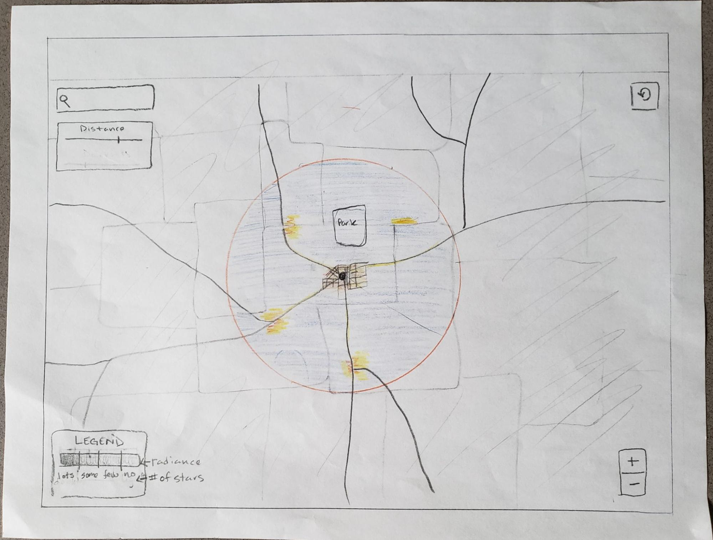
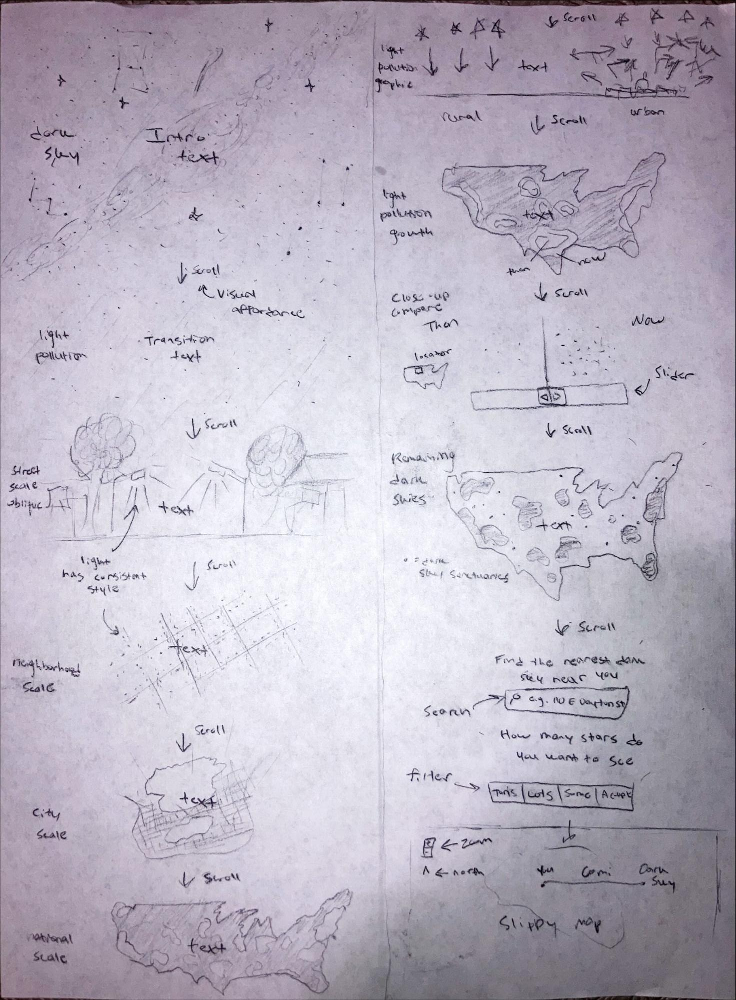
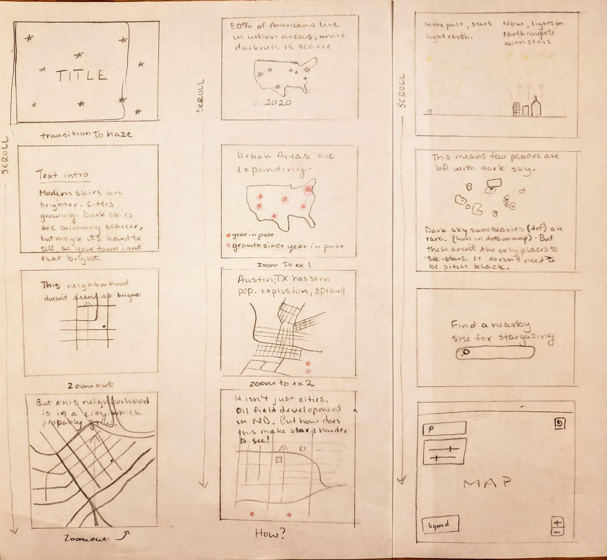
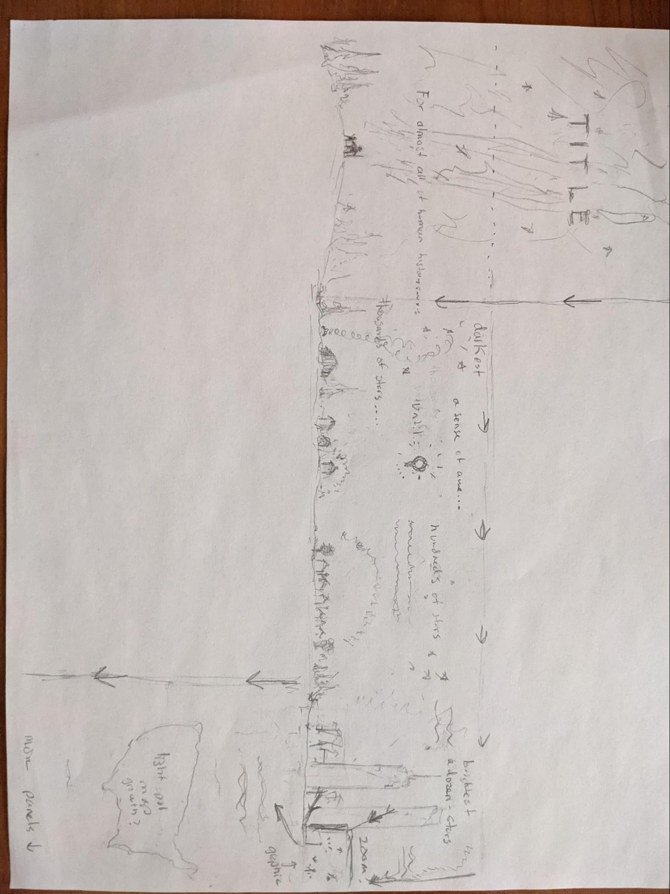
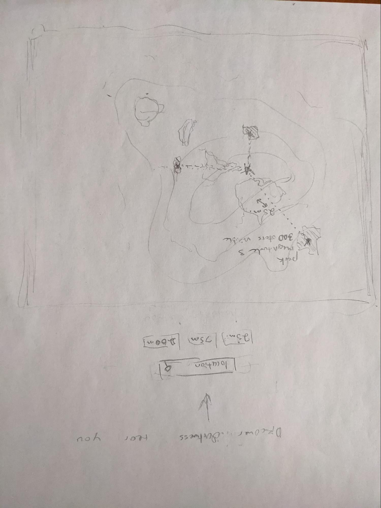

# Dark Skies

### Team Members
Aileen Clarke
Austin Novak
Jake Steinberg

### Project Proposal

#### Target User Profile (Persona):

Juno is a yoga teacher in the Madison area. As a mother, Juno wants to provide her daughter Wednesday with similar meaningful experiences to those she had growing up. When she was 10 years old, Juno visited her friend’s cabin on a lake near Laona in northern Wisconsin. She remembers one night taking the paddleboat out onto the lake on a clear night. The sky that night was the most beautiful, radiant thing she had ever seen. She saw the Milky Way for the first time. She never knew how many stars were up there. She’d like Wednesday to see a night sky like that one too.

Juno does not use computers a lot in her work and does not consider herself very technologically proficient. She’s intimidated by complex interfaces and only just stopped using Yahoo mail. Juno knows you can’t see the night sky as well in the city, but she doesn’t understand why besides there being “too much light.” She’d like to better understand what there being “too much light” means. She’s also heard of so-called “Dark Sky Sanctuaries,” but doesn’t know what’s special about them or even where the nearest one is. Ultimately, Juno would like to search for the nearest place where she and Wednesday could see dark skies, but she’s limited by time and money. She can’t afford to travel out West, or even to northern Wisconsin. She’s willing to compromise if it allows her to accomplish her goal of showing Wednesday skies that are unlike those she’s grown up seeing in the city.

#### User Case Scenario 

Upon arriving at the interactive, Juno is greeted by a vibrant celestial scene reminiscent of the one she experienced in childhood. She starts to scroll, and watches the stars and galaxies fade away. This is emotionally resonant for her, as it reminds her of the beauty she isn’t able to see where she lives. Text blocks explain to Juno she’s not alone in experiencing this. Despite humans living with dark skies for most of their existence, those skies have become increasingly scarce in the modern world. 

Juno continues to scroll. She’s used to scrolling as the primary way she interacts with content on the internet, and she likes the simplicity of the experience. The next couple frames show a typical night time street like the one she lives on. Subsequent frames zoom out to show the block, then the neighborhood, then the city—each frame accentuating the other street lights, building lights and car lights that surround her. This sequence allows Juno to visually identify the phenomenon of “too much light” and associate it with the neighborhood she lives in.

Eventually, the interactive zooms out to show the entire contiguous United States, with beacons of light emanating from its urban areas. Juno then sees a graphic depicting the phenomena of “too much light.” It shows how in areas with no artificial light, the only sources of light come from the stars in the night sky. But in an area with lots of artificial light, those light sources “crowd” out the light from the stars. This gives Juno insight, allowing her to finally understand the “too much light” phenomenon. She’s introduced to the term “light pollution.”

The interactive then returns to the U.S. view. It shows Juno that, within her lifetime, light pollution has expanded considerably. She’s then taken on a tour of examples, such as fast-expanding southern cities and the booming oil and gas fields of North Dakota and Texas. Juno uses a slider prompt to compare how light pollution has grown in these areas. This gives Juno insight into the economic and development patterns that cause and promote light pollution.

Juno is then taken back to the U.S. view. The sources of light pollution vanish, leaving only islands of dark sky across the country. Points reveal the locations of Dark Sky Sanctuaries. Juno is then prompted to input her location to retrieve information about nearby locations that experience a sky sufficiently dark to see significant numbers of celestial bodies. The results appear as a circle with the input location at the center. The radius is also determined by Juno, allowing her to filter out locations that are too far away for her personal constraints. Parks are prominent in the basemap. She filters the results to find an area not farther than 60 miles away. A classed legend explains how different levels of light pollution relate to the number of visible stars. It also aids Juno in selecting a site to visit. She’s willing to forgo seeing the most stars possible for a site that’s closer to Madison. Juno identifies a park to see enough stars, and plans a trip there with Wednesday.

#### Requirements
| # | Name | Info|
| :---: | :---: | :--- |
| 1 | Basemap | US, Canada, Mexico, US states, additional context (lakes, rivers): Natural Earth. (2-dimensional) |
| 2 | Dark Sky Sanctuaries | Locations of Dark Sky Sanctuaries in the US: IDA. Symbolized as points on the map. (2-dimensional) |
| 3 | Light Pollution | Light pollution raster data. Will include most recent available, plus at least 1 historic: NASA VIIRS |
| 4 | Light Pollution Graphic | Simple diagram we will make depicting how radiance/reflection works. |
| 5 | Legend | Indicate brightness/radiance level for color range. Accompanying light pollution data. |
| 6 | Text | Text accompaniment. Intro, info about places on tour, guide for search use. |
| 7 | Overview | Metadata. User Guide. |
| 8 | Video | Narrated video demonstrating functionality. |

#### Interaction
| # | Interaction | Info|
| :---: | :---: | :--- |
| 1 | Scroll | Primary means of accessing subsequent content. Performs similar functionality to zoom and pan. |
| 2 | Image Compare Slider | Overlay: Objects. Display and compare the data over the same area, from two different years. |
| 3 | Scanctuary Hover | Retrieve: Object. Hover over a Dark Sky Sanctuary to see its name, size, year of designation in a pop up.  |
| 4 | Search Box | Search: Location. Use textual search function to identify a specific location. |
| 5 | Search Results | Pan and zoom: Location. User can move around the map of their results and zoom into areas of interest. |
| 6 | Distance Filter Slider | Filter: Object and location. Present user with an option to narrow their search. A slider for adjusting distance parameter.  |
| 7 | Reset Button | Reexpress: Object. Allow user to reset slippy map to full extent of US after search by clicking a button. |

#### Wireframes

This is the most complete and up to date wireframe for the final interactive portion of the story. 

Storyboard versions

